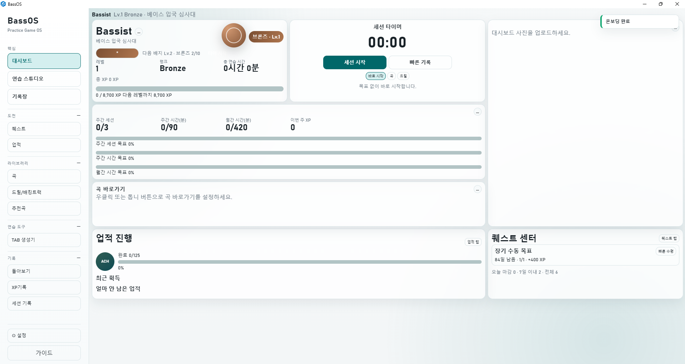

# BassOS

베이스 기타 연습을 "꾸준히 하게" 만드는 Windows 데스크톱 앱입니다.  
연습 기록, 경험치(XP), 레벨, 퀘스트, 업적을 한 앱에서 관리할 수 있습니다.

## 메인 대시보드



## 어떤 앱인가요?
BassOS는 베이스 연습을 게임처럼 기록하고 확인하는 개인용 앱입니다.

- 연습 시작/종료를 빠르게 기록
- 연습 시간을 XP와 레벨로 시각화
- 퀘스트/업적으로 작은 목표를 계속 달성
- 곡/드릴/배킹트랙/기록장을 한곳에서 관리
- 데이터는 내 PC 로컬 파일에 저장

## 이런 분께 추천합니다
- 연습은 하는데 기록이 계속 끊기는 분
- "오늘 뭘 연습할지" 매번 고민하는 분
- 장기적으로 얼마나 늘었는지 눈에 보이는 지표가 필요한 분
- 악기 연습을 게임처럼 재미있게 이어가고 싶은 분

## 핵심 기능
| 영역 | 제공 기능 | 기대 효과 |
| --- | --- | --- |
| 세션 기록 | 대시보드/스튜디오에서 세션 시작·종료, 곡/드릴 대상 지정, 세션 수정·삭제 | 연습 흐름을 끊지 않고 기록 누락을 줄임 |
| 연습 스튜디오 | 곡/드릴 모드, 메트로놈, 참고 영상, 악보, 배킹트랙 연동 | 실제 연습에 필요한 도구를 한 화면에서 사용 |
| 라이브러리 | 곡/드릴/배킹트랙 등록, 상태/태그/즐겨찾기 관리, 검색/필터 | 오늘 연습할 항목을 빠르게 찾고 관리 |
| 기록/분석 | 기간별(주/월/연/사용자 지정) 기록 조회, 활동별 시간·XP 분포, 상위 연습 항목 확인 | “얼마나, 무엇을” 연습했는지 객관적으로 파악 |
| 성장 시스템 | XP, 레벨, 랭크, 퀘스트, 업적(일반/히든) | 작은 달성감을 반복해서 꾸준함 유지 |
| 기록장(Journal) | 텍스트 + 이미지/영상/오디오 기록, 곡/드릴 연결, 태그 검색 | 연습 과정과 결과를 장기적으로 보관/회고 |

## 화면 사용 순서(처음 사용자 기준)
1. `대시보드`에서 세션 시작
2. `연습 스튜디오`에서 곡 또는 드릴 선택
3. `세션 기록`에서 로그 확인/수정
4. `돌아보기`, `마이 XP`에서 변화 확인
5. `퀘스트`, `업적`에서 다음 목표 확인
6. `기록장`에 연습 결과(글/미디어) 남기기

## 데이터와 백업
- 앱 데이터는 로컬 파일(CSV/JSON)로 저장됩니다.
- 종료 시 백업 트리거가 동작하도록 설계되어 있습니다.
- 설정에서 진행도 리셋/전체 리셋 같은 관리자 기능을 사용할 수 있습니다.

## 지원 환경
- Windows 데스크톱 전용
- 최소 창 크기: 1000x700
- 단일 사용자(개인 연습용) 기준

## 다운로드(Release)
정식 Release 다운로드 안내는 준비 중입니다.  
빌드 산출물 업로드 후 이 섹션을 업데이트할 예정입니다.

## 직접 실행(개발/테스트용)
프로젝트 루트에서:

```powershell
./run_dev.ps1
```

API만 실행:

```powershell
./run_dev.ps1 -ApiOnly
```

## EXE 빌드(개발/배포 준비용)
```powershell
./build_exe.ps1
```

기본 결과물 경로:
- `dist/BASSOS/bassos/BassOS.exe`

## FAQ
Q. 인터넷이 꼭 필요한가요?  
A. 기본적으로 로컬 중심으로 동작합니다. 다만 유튜브 링크 재생 같은 기능은 인터넷 연결이 필요합니다.

Q. 데이터는 어디에 저장되나요?  
A. 실행 데이터는 `app/data`, 미디어는 `app/media`, 백업은 `app/backups`에 저장됩니다.

Q. 초보자도 바로 쓸 수 있나요?  
A. 네. 대시보드에서 시작 버튼으로 연습을 기록하고, 이후 탭에서 정리/분석하는 흐름으로 사용하면 됩니다.

Q. 세션을 잘못 저장했을 때 수정할 수 있나요?  
A. 가능합니다. `세션 기록` 탭에서 세션을 수정/삭제하면 XP와 요약 수치도 함께 반영됩니다.

Q. 백업은 언제 생성되나요?  
A. 앱 시작/종료 시점에 백업 트리거가 동작하도록 설계되어 있으며, 설정 메뉴에서 백업 관련 기능을 사용할 수 있습니다.

Q. 새 PC로 데이터를 옮기려면 어떻게 하나요?  
A. 기본적으로 `app/data`, `app/media`, `app/backups` 폴더를 함께 옮기면 기존 기록을 이어서 사용할 수 있습니다.

Q. 연습 중 음악/영상 없이도 사용할 수 있나요?  
A. 가능합니다. 메트로놈/세션 기록 중심으로도 사용할 수 있고, 필요할 때만 영상·링크를 연결해 사용할 수 있습니다.

Q. 앱이 느리거나 레이아웃이 깨져 보이면 어떻게 하나요?  
A. 먼저 창 크기를 최소 `1000x700` 이상으로 맞춰보세요. 문제가 계속되면 앱 재시작 후 최신 데이터/설정을 확인해 주세요.

Q. 개발 모드와 EXE 빌드 모드의 차이는 무엇인가요?  
A. 개발 모드는 `run_dev.ps1`로 빠르게 실행/테스트하고, 배포용 실행 파일은 `build_exe.ps1`로 생성합니다.
